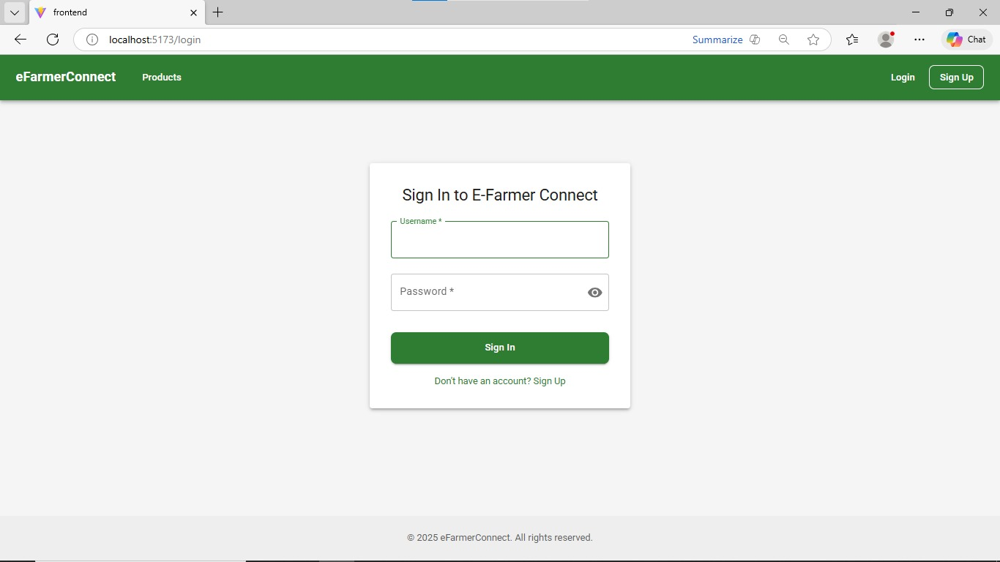
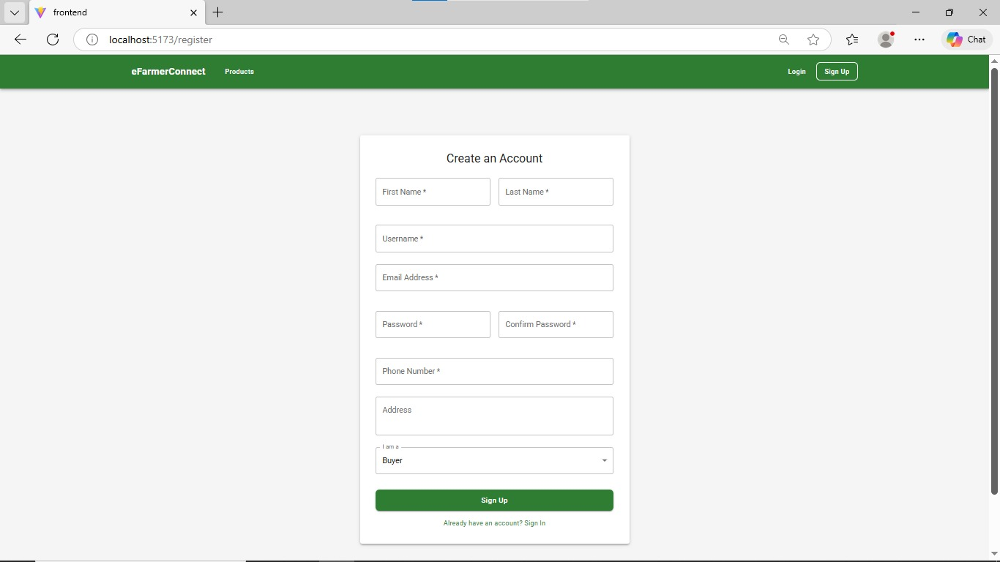
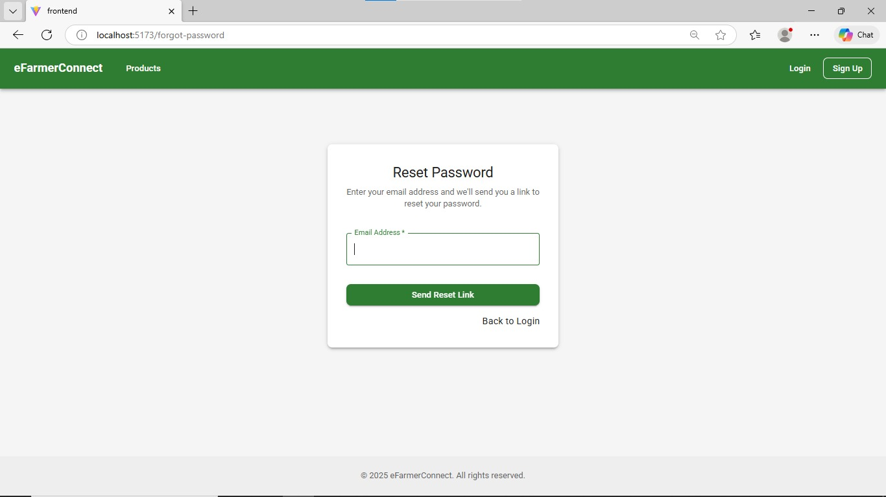
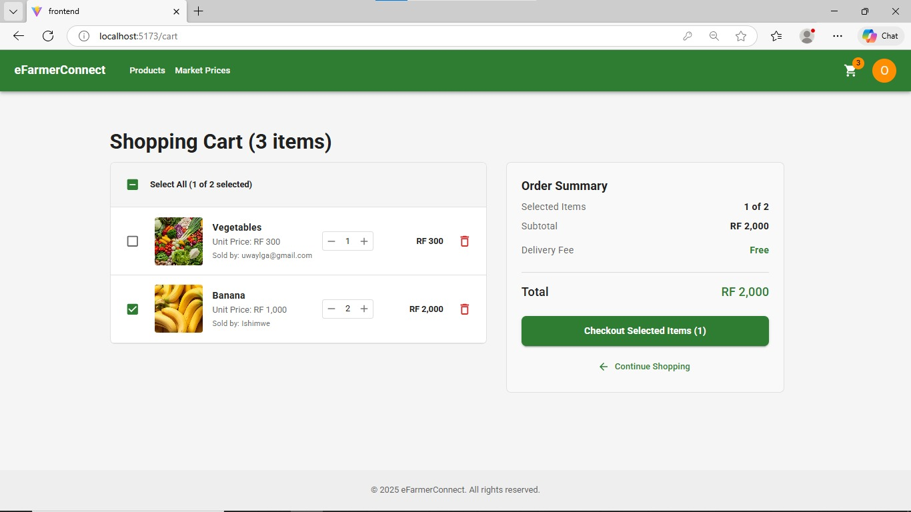
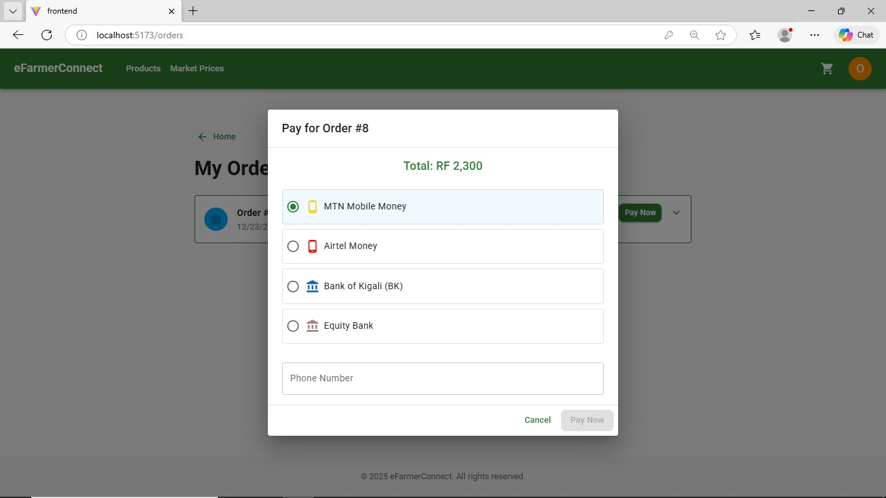
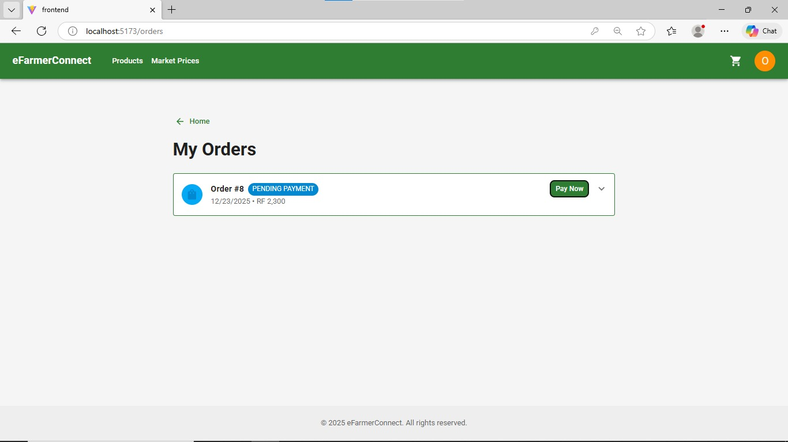
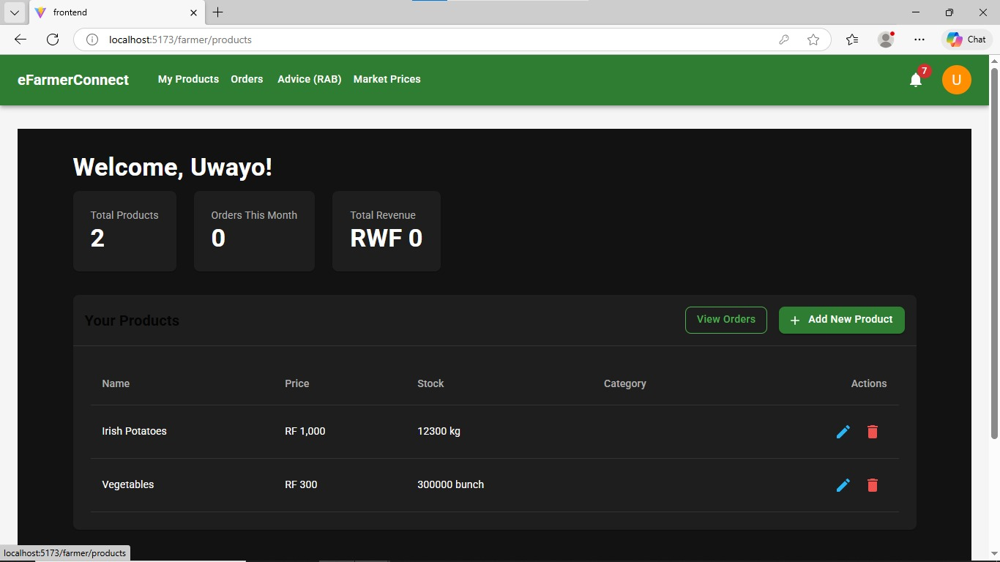
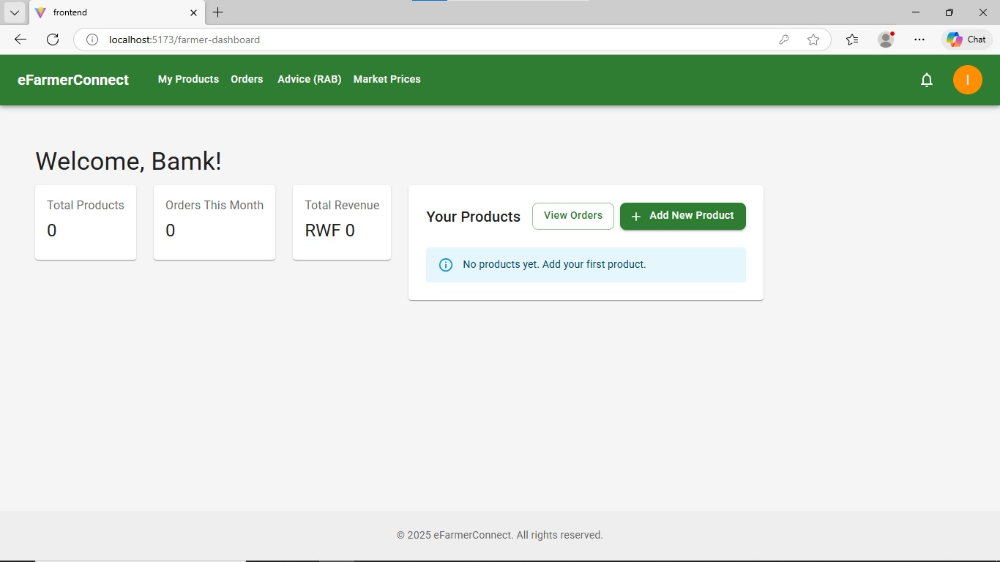
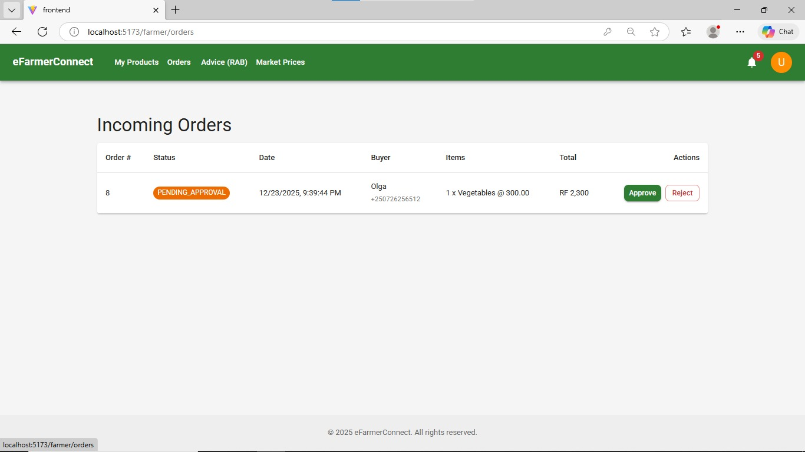
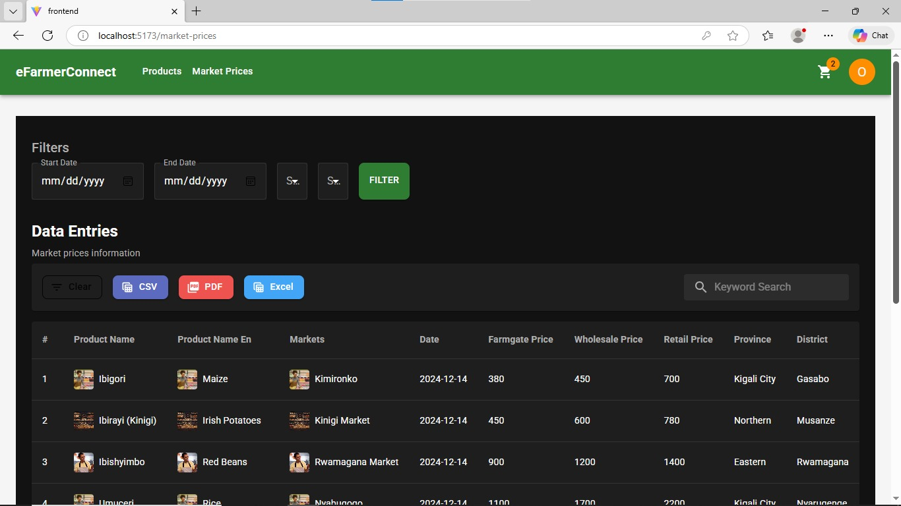

# EFarmerConnect - Agriculture Marketplace Platform

**EFarmerConnect** connects farmers in Rwanda with buyers, ensuring fair pricing and efficient supply chain management.

## 🚀 Tech Stack
- **Frontend**: React (Vite), MUI, Ant Design
- **Backend**: Django 5.1, DRF, JWT Auth

## 🛠️ Setup
1. **Backend**:
   ```bash
   cd Django
   pip install -r requirements.txt
   python manage.py migrate
   python manage.py runserver
   ```
2. **Frontend**:
   ```bash
   cd frontend
   npm install
   npm run dev
   ```

## 📸 Screenshots

### Authentication
Secure login and registration for Farmers and Buyers.


*Login to your account.*


*Register as a new user.*


*Recover your account if you lose your password.*

### Home & Landing
The entry point to the platform.


*Main landing page.*

### Marketplace (Buyers)
Browse products, manage cart, and place orders.


*Browse available agricultural products.*


*Review items before checkout.*


*Secure payment processing.*


*Confirmation of your purchase.*

### Farmer Dashboard
Manage your products and view orders.


*Manage your product listings.*


*Add new products to the marketplace.*


*View and manage incoming orders from buyers.*

### Features
Additional tools for productivity.


*Get tips and advice for better farming.*


*Check current market prices.*
